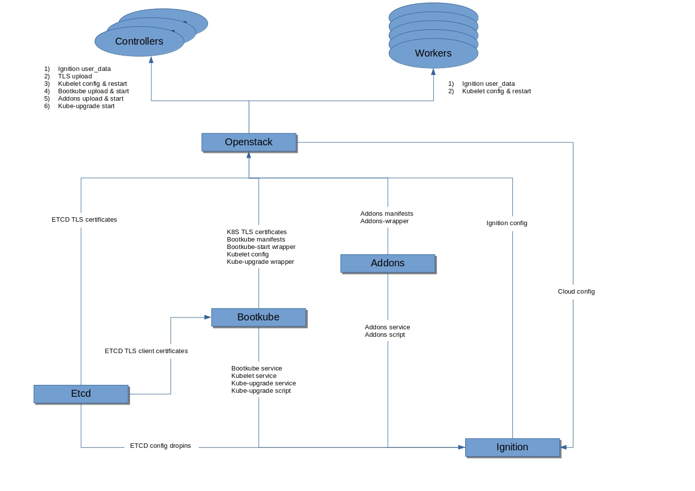

# OPKE global design

This repo is built arround Terraform module pattern. The objective is to decouple each major functionality (K8S, addons, ignition...) in different modules to increase manageability.

Common design rules:
* Immutable configuration files and services are directly injected on hosts through Ignition.
It's important to not put any mutable file in Ignition to ensure no host will be recreated when you upgrade a version for instance
* Mutable files and services, basically everything that contains a version number likely to change over time (Kubernetes upgrade...),
are locally generated then uploaded on hosts through a SSH connection in an idempotent to ensure that it won't trigger any hosts recreation
* Confidential data like TLS certificates are not provisioned through Ignition but through SSH connection because Ignition are injected on hosts through cloud providers `user_data`. It's commonly not encrypted

## OPKE modules

### Addons

This module is in charge of creating all ressources necessary to provision basic Kubernetes common services like monitoring, logging, ingress, dashboard...
It will
* Locally generate all addons manifests that will be uploaded to the first controller and provisioned through kubectl
* Locally generate the addons-wrapper which is an hyperkube in RKT launch script to provide kubectl on the first controller
* Output for Ignition module
  * the addons.service responsible for launching the addons-wrapper
  * the addons-start which is the bash script responsible for launching all the kubectl command to provision the addons manifests

### Bare-metal

Not yet implemented

### Bootkube

This module is in charge of creating all ressources necessary to bootstrap a self hosted and multi masters Kubernetes cluster with Bootkube.
It will
* Locally generate TLS certificates for the Kubernetes cluster configuration that will be uploaded to the first controller through SSH (required for security reason because cloud user_data are generally unencrypted)
* Locally generate all bootkube manifests that will be uploaded to the first controller and provisioned through kubelet static pods (for bootstrap manifests) and through kubectl (for self hosted control plane)
* Locally generate a kubelet configuration file (kubelet.env) which will be uploaded on all hosts before the Kubelet service is started
* Locally generate the kube-upgrade-wrapper which is an hyperkube in RKT launch script to provide kubectl on the first controller
* Output for Ignition module
  * the kubelet.service responsible for launching the kubelet (one version for controllers and one for workers)
  * the kube-upgrade.service responsible for launching the Kubernetes upgrade script
  * the kube-upgrade script which is the bash script responsible for updating the control plane manifests to trigger its rolling upgrade

### Etcd

This module is in charge of creating all ressources necessary to run an ETCD v3 cluster in service mode on the controllers. It will
* Locally generate TLS certificates for ETCD and clients (K8S control plane) that will be uploaded to hosts
* Output an ETCD service configuration for Ignition module

### Ignition

This module is in charge of creating Ignition resources for all necessary files, dropins and services to provision on hosts at boot time.
Domain specific assets (K8S, etcd, addons...) are generated in their respective modules and then passed to the Ignition module.
It will output all the different Ignition resources as individual resources because it allows to customize each Ignition configuration depending on the host role (controller or worker)

### Openstack

This module is a root module in charge of combining the other modules to provision and manage Kubernetes clusters on Openstack.
Please note that all parameters that can be common to multiple platforms are separated from each platform module at the root repo directory

### Global view

